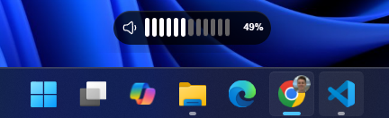
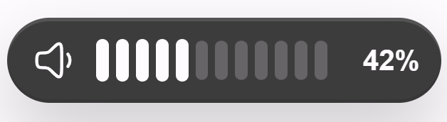

# Volume Scroller

Volume Scroller is a lightweight Windows desktop utility that lets you adjust system volume by scrolling over the taskbar. It pairs a native Tauri backend with a small React overlay, so volume changes feel immediate while the on-screen indicator stays clean and configurable.

## Screenshots

| Taskbar Overlay | Overlay Close-Up |
| --- | --- |
|  |  |

## Features

- Scroll over the Windows taskbar to raise or lower the default output volume.
- Supports vertical and horizontal mouse wheel input, including precision wheel deltas.
- Native Windows audio control through the default render endpoint.
- Floating always-on-top overlay with smooth show/hide animation.
- Configurable scroll speed, direction, overlay size, position, and offset.
- Optional tray icon with settings, update-check placeholder, and quit actions.
- Startup preference support through the current user's Windows Run registry key.
- Theme presets for Monochrome, Windows 11, Ubuntu, and Solarized styling.
- Fullscreen-app pause option to avoid accidental volume changes while gaming or presenting.

## Tech Stack

- Tauri 2 for the desktop shell and native window/tray integration.
- Rust for Windows hooks, audio endpoint control, settings persistence, and startup sync.
- React, TypeScript, and Vite for the overlay and settings UI.
- Iconify Hugeicons for the volume and settings interface icons.

## Requirements

- Windows 10 or Windows 11 for the full taskbar scrolling experience.
- Node.js and npm.
- Rust and Cargo.
- Tauri system prerequisites for Windows development.

The app includes non-Windows fallbacks for development, but taskbar wheel detection and system volume control are Windows-focused.

## Getting Started

Install dependencies:

```bash
npm install
```

Run the web UI in development:

```bash
npm run dev
```

Run the desktop app in development:

```bash
npm run tauri:dev
```

Build the frontend:

```bash
npm run build
```

Build the packaged Tauri app:

```bash
npm run tauri:build
```

## Project Structure

```text
src/                  React overlay and settings UI
src-tauri/src/        Rust backend, taskbar hook, audio control, and preferences
public/               App icon assets
Screenshots/          README screenshots
dist/                 Built frontend output
```

## Configuration

Preferences are saved by the Tauri backend in the app config directory as `preferences.json`. From the settings window you can adjust behavior, scroll direction, speed, overlay scale, exact position, and theme.

## License

No license file is included yet. Add one before distributing or accepting outside contributions.
